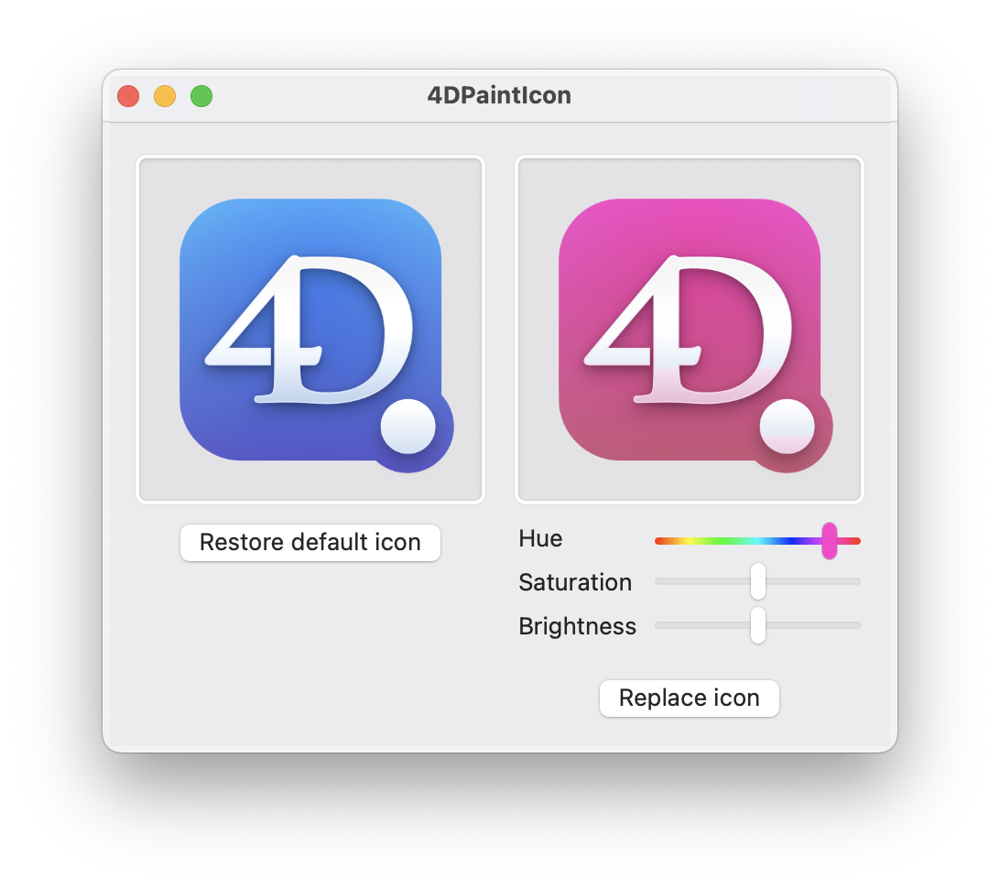

# 4DPaintIcon

Have you ever wished the 4D icon could get a fresh coat of paint to match the colorful Mac you just bought?
Or you want to distinguish a version from one another.
4DPaintIcon lets you do this by simply adjusting a few sliders.

[Original app is for Xcode](https://github.com/DerLobi/XcoatOfPaint)

## How to run
### Prebuilt release
Download the latest release from [GitHub](https://github.com/mesopelagique/4DPaintIcon/releases/latest/download/4DPaintIcon.zip)

Requires macOS 11 Big Sur

### Build from source
Just download the project and _"Build and Run"_ from Xcode.

## Usage

* Drag the 4D app onto the left side of the app
* Change hue, saturation and brightness to your liking
* Click on "Replace Icon"

If 4D is currently running, you will need to close it and open it again before the icon change takes effect.

To restore the original icon, click on "Restore default icon" or, select the existing icon in the "Get Info" dialog and hit the delete key.

## License

[MIT License](https://github.com/DerLobi/XcoatOfPaint/blob/main/LICENSE)

## 3rd party components
* Color cube code taken from [https://github.com/trav-ma/TMReplaceColorHue](https://github.com/trav-ma/TMReplaceColorHue)
* Compiled asset catalog extraction code taken from [https://github.com/bartoszj/acextract](https://github.com/bartoszj/acextract)
